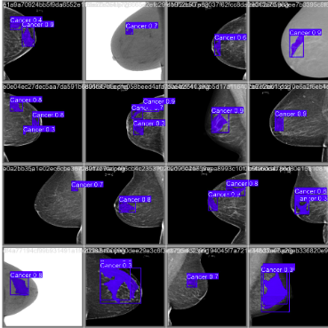

# BREAST-CANCER DETECTION USING 1D CONVOLUTIONAL NEURAL NETWORK WITH INTERSECTION OVER UNION TECHNOLOGIE
<a name="readme-top"></a>
[![Contributors][contributors-shield]][contributors-url]
[![Forks][forks-shield]][forks-url]
[![Stargazers][stars-shield]][stars-url]
[![Issues][issues-shield]][issues-url]
[![MIT License][license-shield]][license-url]
[![LinkedIn][linkedin-shield]][linkedin-url]

<!-- logo-->
<br />
<div align="center">
  <a href="#">
    
  </a>

  <h3 align="center">Breast Cancer Detection Using 1D Convolutional Neural Network with Intersection Over Union Technologie</h3>

  <p align="center">
    A novel approach for breast cancer detection using YOLOv8 segmentation model
    <br />
    <a href="https://github.com/bouslama-hamza"><strong>Explore the docs</strong></a>
    <br />
    <br />
  </p>
</div>

<!-- ABOUT THE PROJECT -->
## About The Project
<div align="justify">
Breast cancer remains a leading cause of mortality among women worldwide, underscoring the critical need for accurate and early detection methods. This project presents a novel approach for breast cancer detection using the YOLOv8 segmentation model, leveraging its advanced object detection capabilities to identify malignant regions in medical images. Our approach involves training the YOLOv8 model on a comprehensive dataset of annotated breast cancer images, employing various data augmentation techniques to enhance model robustness. The proposed method demonstrates superior performance in terms of precision, recall, and intersection-over-union (IoU) metrics, achieving an accuracy of 96%.

<div align="center">
<a href="#">
    
  </a>
</div>

This solution addresses the limitations of existing detection methods by providing a more accurate and efficient approach to identifying malignant regions in breast cancer images. By focusing on key spectral features, we can improve the model's performance and interpretability.

</div>

<p align="right">(<a href="#readme-top">back to top</a>)</p>

## Project Context
<div align="center">
    <a href="#">
    
  </a>
</div>
<br>
<div align="justify">
Our solution involves a systematic process of evaluating different wavelength selection methods, such as genetic algorithms, interval partial least squares (iPLS), and successive projections algorithm (SPA). Following the KDD process, we first preprocess the data by normalizing the spectral data and splitting it into training and test sets. We then apply the wavelength selection methods to identify the most informative wavelengths for each model.
</div>

## Project Architecture

<div align="center">
    <a href="#">
        
     </a>
</div>
<br>
<div align="justify">
To enhance the efficiency of our approach, we implemented different machine learning models using the LazyPredict library, ultimately choosing SMIO, Linear Regression, Glmnet, and PLSregression to predict the concentration of the chemical compound.
</div>

## Built In Technologie
There are numerous technologies employed in this project, focusing on the most crucial ones:

* [![Django][Django.com]][Django-url]
* [![Bootstrap][Bootstrap.com]][Bootstrap-url]
* [![JQuery][JQuery.com]][JQuery-url]

<p align="right">(<a href="#readme-top">back to top</a>)</p>


<!-- GETTING STARTED -->
## Getting Started

_The project's concept may seem sophisticated, but the steps for getting started are quite simple._

1. Ensure that a connection is established.
2. Clone the repository:
   ```
   git clone https://github.com/bouslama-hamza/CHEMOMETRICS.git
   ```

3. Navigate to the project directory:
   ```
   cd Real Time Web/
   ```

4. Install Django packages:
   ```
   pip install -r requirements.txt
   ```

5. Make migrations to set up the database:
   ```
    python manage.py makemigrations
   ``` 
   ```
    python manage.py migrate
   ```

6. Run the server:
   ```
    python manage.py runserver
    ```

<p align="right">(<a href="#readme-top">back to top</a>)</p>


<!-- CONTRIBUTING -->
## Contributing

Contributions are what make the open source community such an amazing place to learn, inspire, and create. Any contributions you make are **greatly appreciated**.

<p align="right">(<a href="#readme-top">back to top</a>)</p>


<!-- CONTACT -->
## Contact

Hamza Bouslama - [Gmail Account](ham.bousa98@gmail.com)

Project Link: [https://github.com/bouslama-hamza/CHEMOMETRICS.git](https://github.com/bouslama-hamza/CHEMOMETRICS.git)

<p align="right">(<a href="#readme-top">back to top</a>)</p>

<!-- MARKDOWN LINKS & IMAGES -->
<!-- https://www.markdownguide.org/basic-syntax/#reference-style-links -->
[contributors-shield]: https://img.shields.io/github/contributors/othneildrew/Best-README-Template.svg?style=for-the-badge
[contributors-url]: https://github.com/othneildrew/Best-README-Template/graphs/contributors
[forks-shield]: https://img.shields.io/github/forks/othneildrew/Best-README-Template.svg?style=for-the-badge
[forks-url]: https://github.com/othneildrew/Best-README-Template/network/members
[stars-shield]: https://img.shields.io/github/stars/othneildrew/Best-README-Template.svg?style=for-the-badge
[stars-url]: https://github.com/othneildrew/Best-README-Template/stargazers
[issues-shield]: https://img.shields.io/github/issues/othneildrew/Best-README-Template.svg?style=for-the-badge
[issues-url]: https://github.com/othneildrew/Best-README-Template/issues
[license-shield]: https://img.shields.io/github/license/othneildrew/Best-README-Template.svg?style=for-the-badge
[license-url]: https://github.com/othneildrew/Best-README-Template/blob/master/LICENSE.txt
[linkedin-shield]: https://img.shields.io/badge/-LinkedIn-black.svg?style=for-the-badge&logo=linkedin&colorB=555
[linkedin-url]: https://linkedin.com/in/hamza-bouslama
[Django.com]:https://img.shields.io/badge/Django-0769AD?style=for-the-badge&logo=django&logoColor=white
[Django-url]:https://www.djangoproject.com/
[Bootstrap.com]: https://img.shields.io/badge/Bootstrap-563D7C?style=for-the-badge&logo=bootstrap&logoColor=white
[Bootstrap-url]: https://getbootstrap.com
[JQuery.com]: https://img.shields.io/badge/jQuery-0769AD?style=for-the-badge&logo=jquery&logoColor=white
[JQuery-url]: https://jquery.com
