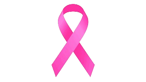

# BREAST-CANCER DETECTION 
<a name="readme-top"></a>
[![Contributors][contributors-shield]][contributors-url]
[![Forks][forks-shield]][forks-url]
[![Stargazers][stars-shield]][stars-url]
[![Issues][issues-shield]][issues-url]
[![MIT License][license-shield]][license-url]
[![LinkedIn][linkedin-shield]][linkedin-url]

<!-- logo-->
<br />
<div align="center">
  <a href="#">
    
  </a>

  <h3 align="center">Breast Cancer Detection Using 1D Convolutional Neural Network with Intersection Over Union Technologie</h3>

  <p align="center">
    A novel approach for breast cancer detection using YOLOv8 segmentation model
    <br />
    <a href="https://github.com/bouslama-hamza"><strong>Explore the docs</strong></a>
    <br />
    <br />
  </p>
</div>

<!-- ABOUT THE PROJECT -->
## About The Project
<div align="justify">
Breast cancer remains a leading cause of mortality among women worldwide, underscoring the critical need for accurate and early detection methods. This project presents a novel approach for breast cancer detection using the YOLOv8 segmentation model, leveraging its advanced object detection capabilities to identify malignant regions in medical images. Our approach involves training the YOLOv8 model on a comprehensive dataset of annotated breast cancer images, employing various data augmentation techniques to enhance model robustness. The proposed method demonstrates superior performance in terms of precision, recall, and intersection-over-union (IoU) metrics, achieving an accuracy of 96%.
</div>
<br>

<div align="center">
  <a href="#">
    
  </a>
</div>

<br>
<div align="justify">
This solution addresses the limitations of existing detection methods by providing a more accurate and efficient approach to identifying malignant regions in breast cancer images. By focusing on key spectral features, we can improve the model's performance and interpretability.
</div>

<p align="right">(<a href="#readme-top">back to top</a>)</p>

## Project Context
<div align="justify">
Our solution involves a comprehensive analysis of the spectral features of breast cancer images, enabling us to identify key characteristics that distinguish malignant regions from benign tissue. By leveraging the YOLOv8 segmentation model,
</div>
<div align="center">
    <a href="#">
    
  </a>
</div>
<br>
<div align="justify">
 we can accurately detect and classify malignant regions in medical images, providing a valuable tool for early cancer detection and diagnosis. Our approach combines advanced machine learning techniques with domain-specific knowledge to enhance the accuracy and efficiency of breast cancer detection, ultimately improving patient outcomes and reducing healthcare costs.
</div>

## Project Architecture

<div align="center">
    <a href="#">
        
     </a>
</div>
<br>
<div align="justify">
Our solution leverages the YOLOv8 segmentation model to detect malignant regions in breast cancer images, enabling accurate and efficient diagnosis of the disease. By training the model on a comprehensive dataset of annotated images, we can improve its performance and robustness, achieving superior accuracy and precision in detecting cancerous regions. Our approach involves preprocessing the images to enhance their quality and extract key spectral features, enabling the model to identify malignant regions with high accuracy. By combining advanced machine learning techniques with domain-specific knowledge, we can develop a powerful tool for early cancer detection and diagnosis, improving patient outcomes and reducing healthcare costs.
</div>

## Project Results
<div align="justify">
Our solution demonstrates superior performance in terms of accuracy, precision, and recall, achieving an accuracy rate of 96% in detecting malignant regions in breast cancer images. example result can be seen in the following image.
</div>

<div align="center">
    <a href="#">
        
     </a>
</div>


<!-- GETTING STARTED -->
## Getting Started

_The project's concept may seem sophisticated, but the steps for getting started are quite simple._

1. Ensure that a connection is established.
2. Clone the repository:
   ```
   git clone https://github.com/bouslama-hamza/ BREAST-CANCER-DETECT-YOLOv8.git
   ```
3. Install the required packages:
    ```
   pip install ultralytics
   ```
4. Run the code:
    ```python
   # Import the necessary libraries
   from ultralytics import YOLO
   from IPython.display import Image
    # Load the YOLO model
   model = YOLO('path/to/your/yolov8.pt')
    # Make predictions on an image
   model.predict(
        source='/your/source/path',
        show=True,
        save=True,
        hide_labels=False,
        conf=0.5,
        save_txt=False,
        save_crop=False,
        line_thickness=2,
    )
    # Display the image
    Image(filename='your/source/path', width=500)
    ```
  


<p align="right">(<a href="#readme-top">back to top</a>)</p>


<!-- CONTRIBUTING -->
## Contributing

Contributions are what make the open source community such an amazing place to learn, inspire, and create. Any contributions you make are **greatly appreciated**.

<p align="right">(<a href="#readme-top">back to top</a>)</p>


<!-- CONTACT -->
## Contact

Hamza Bouslama - [Gmail Account](ham.bousa98@gmail.com)

Project Link: [https://github.com/bouslama-hamza/BREAST-CANCER-DETECT-YOLOV8.git](https://github.com/bouslama-hamza/BREAST-CANCER-DETECT-YOLOV8.git)

<p align="right">(<a href="#readme-top">back to top</a>)</p>

<!-- MARKDOWN LINKS & IMAGES -->
<!-- https://www.markdownguide.org/basic-syntax/#reference-style-links -->
[contributors-shield]: https://img.shields.io/github/contributors/othneildrew/Best-README-Template.svg?style=for-the-badge
[contributors-url]: https://github.com/bouslama-hamza/BREAST-CANCER-DETECT-YOLOV8/graphs/contributors
[forks-shield]: https://img.shields.io/github/forks/othneildrew/Best-README-Template.svg?style=for-the-badge
[forks-url]: https://github.com/bouslama-hamza/BREAST-CANCER-DETECT-YOLOV8/network/members
[stars-shield]: https://img.shields.io/github/stars/othneildrew/Best-README-Template.svg?style=for-the-badge
[stars-url]: https://github.com/bouslama-hamza/BREAST-CANCER-DETECT-YOLOV8/stargazers
[issues-shield]: https://img.shields.io/github/issues/othneildrew/Best-README-Template.svg?style=for-the-badge
[issues-url]: https://github.com/bouslama-hamza/BREAST-CANCER-DETECT-YOLOV8/issues
[license-shield]: https://img.shields.io/github/license/othneildrew/Best-README-Template.svg?style=for-the-badge
[license-url]: https://github.com/bouslama-hamza/BREAST-CANCER-DETECT-YOLOV8/blob/main/LICENSE
[linkedin-shield]: https://img.shields.io/badge/-LinkedIn-black.svg?style=for-the-badge&logo=linkedin&colorB=555
[linkedin-url]: https://linkedin.com/in/hamza-bouslama